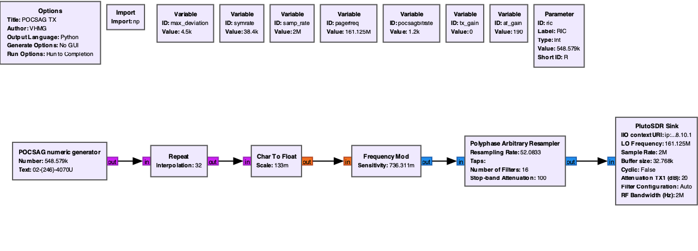

# POCSAG TX

GNU Radio flow graph that transmits **POCSAG numeric** pager messages over the air using an [ADALM-Pluto](https://www.analog.com/en/design-center/evaluation-hardware-and-software/evaluation-boards-kits/adalm-pluto.html) SDR.
<video width="640" height="360" controls>
  <source src="pocsag_tx.mov" type="video/mp4">
  Your browser does not support the video tag.
</video>
**License:** GPL-3.0  
**Author:** VHMG  
**GNU Radio:** 3.10.x (generated with 3.10.11.0)

## Overview

The transmitter chain:



1. **POCSAG encoder** (`pocsag_tx_pocsag_numeric.py`) — builds the POCSAG frame (sync, address, numeric payload, CRC/parity) and outputs ±1 symbols.
2. **Upsampling** — repeats symbols to match the modem symbol rate.
3. **FM modulator** — frequency-modulates the baseband.
4. **Arbitrary resampler** — matches Pluto sample rate (2 MS/s).
5. **Pluto sink** — transmits on the configured pager frequency.

Default RF settings target the **161.125 MHz** pager band with **1200 baud** POCSAG and **±4.5 kHz** peak deviation.

## Requirements

### Hardware

- ADALM-Pluto (or compatible `iio` device), reachable at the configured URI (default `ip:192.168.10.1`)
- Antenna suitable for the transmit frequency
- A POCSAG-capable receiver for testing

### Software

- [GNU Radio](https://www.gnuradio.org/) 3.10 with Python bindings
- GNU Radio **IIO** blocks (`gnuradio.iio`) for Pluto
- Python packages: `numpy`, `bitstring`

Install GNU Radio and IIO support using your distribution’s packages or [PyBOMBS](https://github.com/gnuradio/pybombs). On many systems:

```bash
pip install bitstring numpy
```

## Project files

| File | Description |
|------|-------------|
| `pocsag_tx.py` | Main flow graph (run this) |
| `pocsag_tx.grc` | GNU Radio Companion source — edit and re-generate Python |
| `pocsag_tx_pocsag_numeric.py` | Embedded block: POCSAG **numeric** message encoder |

## Usage

From the project directory:

```bash
python3 pocsag_tx.py
```

### Numeric message format

The numeric encoder accepts up to **20 digits** and these extra symbols (4-bit POCSAG numeric coding):

| Char | Meaning | Char | Meaning |
|------|---------|------|---------|
| `0`–`9` | Digits | `U` / `u` | Urgent |
| `-` / `_` | Hyphen | `[` `{` `(` | Left bracket |
| `]` `}` `)` | Right bracket | * | Asterisk (default for unknown chars) |

Longer text is truncated with a warning.

## Default parameters

These are defined in `pocsag_tx.py` (and in `pocsag_tx.grc`):

| Parameter | Default | Notes |
|-----------|---------|--------|
| `pagerfreq` | 161.125 MHz | Pluto TX frequency |
| `pocsagbitrate` | 1200 | POCSAG bit rate (baud) |
| `symrate` | 38400 | Symbol rate before resampling |
| `samp_rate` | 2 MS/s | Pluto sample rate |
| `max_deviation` | 4500 Hz | FM peak deviation |
| `af_gain` | 190 | Audio/baseband scaling into modulator |
| Pluto URI | `ip:192.168.10.1` | Change in source or GRC if needed |
| TX attenuation | 20 dB (channel 0) | Reduce if legal and hardware allow |

Edit `pocsag_tx.grc` in GNU Radio Companion and **Generate** to refresh `pocsag_tx.py` after changing blocks or variables.

## Editing in GNU Radio Companion

1. Open `pocsag_tx.grc` in GRC.
2. Adjust variables (frequency, gains, RIC, message text on the POCSAG block).
3. Generate → `pocsag_tx.py`.
4. Run from the terminal or GRC’s Run button.


## Legal and safety

Transmitting on pager or other licensed spectrum may be **illegal** without authorization. Use a suitable attenuator, shielded setup, or license-free ISM test frequency only where permitted. You are responsible for compliance with local regulations.

## Credits

- Numeric POCSAG encoding logic is derived from **gr-pocsag** (Kristoff Bonne, ON1ARF), GPL-3.0 — see comments in `pocsag_tx_pocsag_numeric.py` 
